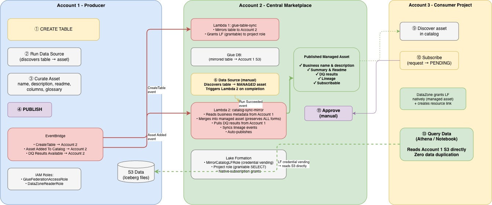

# Cross-Domain Data Product Publication & Subscription

Publish data products from one SageMaker Unified Studio (SMUS) domain and make them discoverable, subscribable, and queryable in another domain without data duplication.

## Overview

This solution enables cross-domain data product publication and subscription in SageMaker Unified Studio (SMUS). It lets you publish a data product in one SMUS domain and make it discoverable, subscribable, and queryable in another domain, while the data stays in the producer's account and is read in place.

It extends the native SMUS experience so organizations with multiple domains (for example, separate business units, regulatory boundaries, or newly acquired teams) can share governed data products across those boundaries and consume them through the standard SMUS subscription workflow.

## Use cases

- Share curated data products across business-unit or regulatory domain boundaries.
- Offer a central "marketplace" domain where products from many producer domains are discoverable in one place.
- Give consumers a familiar SMUS subscribe-and-query experience for data that lives in another domain, with Lake Formation governing access and no data duplication.

## How it works

Event-driven catalog mirroring with two Lambda functions that sync table metadata, business context, data quality results, and lineage across domains. Consumers subscribe and query through native SMUS workflows with Lake Formation governing access.

### Key Features

- **Zero-copy data access**: consumers read producer's S3 directly via LF credential vending
- **Native DataZone subscription fulfilment**: managed assets with automatic LF grants on approval
- **Business metadata sync**: name, description, readme, column descriptions from producer domain
- **DQ results propagation**: pulled from producer on each sync cycle
- **Lineage sync**: OpenLineage events forwarded across domains
- **Lake Formation fine-grained access control**: column/row level security in the consumer domain

## Architecture



## Components

| Component | Purpose |
|-----------|---------|
| `lambda/glue_table_sync.py` | Mirrors the Glue table schema (including partition keys) and grants Lake Formation permissions to the project role |
| `lambda/catalog_sync_mirror.py` | Syncs business metadata, DQ results, and lineage; creates and publishes the managed-asset revision |
| `cloudformation/template.yaml` | Marketplace-account stack: Lambdas, scoped EventBridge rules, dead-letter queues, least-privilege IAM, and the Lake Formation role |
| `cloudformation/producer-account.yaml` | Producer-account stack: the three cross-account roles and the EventBridge forwarding rules |
| `tests/` | Unit tests for both Lambdas (mocked boto3) |
| `Makefile` | `make verify` (lint + tests) and `make package` (build deployment zips) |

## Prerequisites

- Two AWS accounts with SMUS domains configured
- Producer account: Tables in a Glue database, S3 bucket with data
- Marketplace account: SMUS project with Lakehouse Database environment
- Cross-account EventBridge permissions configured
- Lake Formation: Producer's S3 location registered in Marketplace account

## Deployment

### Cross-account trust model

This solution runs in the Marketplace account and reaches into the Producer account. The Marketplace `CatalogSyncLambdaRole` assumes roles in the Producer account, so the Producer roles must trust the Marketplace account. There are three separate cross-account paths, and they use different mechanisms. Do not merge them into one role.

| Path | Direction | Mechanism |
|------|-----------|-----------|
| Metadata and DQ reads | Marketplace `CatalogSyncLambdaRole` assumes Producer `GlueFederationAccessRole` and `DataZoneReaderRole` | `sts:AssumeRole` |
| Event forwarding | Producer EventBridge rules send events to the Marketplace default event bus | `events:PutEvents` via a Producer events role trusting `events.amazonaws.com` |
| S3 zero-copy reads | Marketplace `MirrorCatalogLFRole` reads Producer S3 | Lake Formation credential vending, allowed by the Producer S3 bucket policy |

Steps 4, 5, and 6 implement this model in the Producer account.

### Step 1: Build and upload the Lambda packages

```bash
make package
# Upload the artifacts to a bucket the Marketplace CloudFormation stack can read
aws s3 cp build/glue_table_sync.zip     s3://<CODE_BUCKET>/glue_table_sync.zip
aws s3 cp build/catalog_sync_mirror.zip s3://<CODE_BUCKET>/catalog_sync_mirror.zip
```

### Step 2: Deploy the Producer-account stack (Account 1)

This creates `GlueFederationAccessRole`, `DataZoneReaderRole`, `EventForwardingRole`, and the two EventBridge forwarding rules. It implements the cross-account trust model above.

```bash
aws cloudformation deploy \
  --template-file cloudformation/producer-account.yaml \
  --stack-name cross-domain-data-product-sync-producer \
  --parameter-overrides \
    MarketplaceAccountId=<MARKETPLACE_ACCOUNT_ID> \
    MarketplaceRegion=<MARKETPLACE_REGION> \
    ProducerDatabase=<PRODUCER_GLUE_DB> \
    ProducerS3BucketArn=arn:aws:s3:::<PRODUCER_S3_BUCKET> \
  --capabilities CAPABILITY_NAMED_IAM
```

Then add `DataZoneReaderRole` as a **Contributor** to the Producer's SMUS project (required for `GetAsset`).

### Step 3: Deploy the Marketplace-account stack (Account 2)

This creates `CatalogSyncLambdaRole`, `MirrorCatalogLFRole`, both Lambdas (from the uploaded packages), the scoped EventBridge rules, dead-letter queues, and the event-bus policy. Use the role ARNs output by the Producer stack.

```bash
aws cloudformation deploy \
  --template-file cloudformation/template.yaml \
  --stack-name cross-domain-data-product-sync \
  --parameter-overrides \
    SourceAccountId=<PRODUCER_ACCOUNT_ID> \
    SourceDatabase=<PRODUCER_GLUE_DB> \
    SourceDomainId=<PRODUCER_DOMAIN_ID> \
    SourceProjectId=<PRODUCER_PROJECT_ID> \
    TargetDatabase=<MARKETPLACE_GLUE_DB> \
    DomainId=<MARKETPLACE_DOMAIN_ID> \
    ProjectId=<MARKETPLACE_PROJECT_ID> \
    ProjectEnvironmentRoleArn=<MARKETPLACE_PROJECT_ENV_ROLE_ARN> \
    SourceGlueRoleArn=<GlueFederationAccessRole_ARN_from_producer_stack> \
    SourceDataZoneRoleArn=<DataZoneReaderRole_ARN_from_producer_stack> \
    S3BucketArn=arn:aws:s3:::<PRODUCER_S3_BUCKET> \
    CodeS3Bucket=<CODE_BUCKET> \
  --capabilities CAPABILITY_NAMED_IAM
```

### Step 4: Manual setup in the Marketplace account (Account 2)

| Step | Action | Why |
|------|--------|-----|
| 4a | Register Producer's S3 location in Lake Formation with `MirrorCatalogLFRole` | Enables credential vending for cross-account S3 reads |
| 4b | Add `CatalogSyncLambdaRole` as **Contributor** to the Marketplace SMUS project | Lambda needs DataZone permissions to search/update assets |
| 4c | Create a **Data Source** in the Marketplace project pointing to the target Glue database | Required for creating managed assets (subscription-eligible) |
| 4d | Enable LF Application Integration Settings: "Allow external engines to access data in Amazon S3 locations with full table access" | Required for credential vending to work |

```bash
# 4a: Register S3 location
aws lakeformation register-resource \
  --resource-arn arn:aws:s3:::<PRODUCER_S3_BUCKET>/<PATH> \
  --role-arn arn:aws:iam::<MARKETPLACE_ACCOUNT_ID>:role/MirrorCatalogLFRole \
  --use-service-linked-role false

# 4b: Add Lambda role as project Contributor (via SMUS UI or API)
# Navigate to: SMUS Portal -> Project -> Members -> Add Member -> CatalogSyncLambdaRole
```

### Step 5: S3 bucket policy in the Producer account (Account 1)

The Producer stack (Step 2) creates the roles and forwarding rules. The S3 bucket policy must still be updated manually so the Marketplace `MirrorCatalogLFRole` can read the underlying data:

```json
{
  "Effect": "Allow",
  "Principal": {
    "AWS": "arn:aws:iam::<MARKETPLACE_ACCOUNT_ID>:role/MirrorCatalogLFRole"
  },
  "Action": ["s3:GetObject", "s3:ListBucket"],
  "Resource": [
    "arn:aws:s3:::<PRODUCER_BUCKET>",
    "arn:aws:s3:::<PRODUCER_BUCKET>/*"
  ]
}
```

> CloudTrail must be enabled in the Producer account. Glue has no native (non-CloudTrail) EventBridge events for table operations, so `CreateTable`/`UpdateTable` are delivered as `AWS API Call via CloudTrail` events.

### Setup Summary

| What | Where | How |
|------|-------|-----|
| Package and upload Lambda code | Build machine | `make package` + `aws s3 cp` |
| Producer stack (3 roles + forwarding rules) | Producer account | `cloudformation deploy` (`producer-account.yaml`) |
| Marketplace stack (Lambdas, DLQs, rules, roles) | Marketplace account | `cloudformation deploy` (`template.yaml`) |
| LF S3 registration | Marketplace account | CLI (`register-resource`) |
| CatalogSyncLambdaRole as project Contributor | Marketplace SMUS project | UI or API |
| Data Source creation | Marketplace SMUS project | UI |
| LF Application Integration Settings | Marketplace account | LF Console |
| DataZoneReaderRole as project Contributor | Producer SMUS project | UI |
| S3 bucket policy update | Producer account | S3 Console/CLI |

## End-to-End Workflow

### First-time setup

1. Producer: create a table. It auto-mirrors to the Marketplace account (about 30s via CloudTrail).
2. Producer: run the data source, curate the asset (name, description, readme), and publish.
3. Marketplace: run the data source (manual) to create the managed asset. This triggers the metadata overlay.
4. Consumer: discover the asset, subscribe, get approval, and query the data.

### Ongoing updates

- Re-publish in the Producer to auto-sync metadata to the Marketplace.
- Schema changes are auto-mirrored via the Glue table sync.
- DQ results are pulled from the Producer during the next sync cycle.

## Development

```bash
make install   # install dev dependencies (boto3, pytest)
make verify    # byte-compile the Lambdas and run unit tests
make package   # build deployment zips into build/
```

## Known Limitations

| Limitation | Workaround |
|-----------|------------|
| Glossary terms not synced (domain-scoped) | Create matching terms in the Marketplace domain manually |
| Data source run is manual | Schedule hourly or trigger via the `StartDataSourceRun` API |
| Subscription approval in the Marketplace account only | Route notifications to the Producer via EventBridge and a callback |
| About 30s latency for table sync (CloudTrail-based) | Acceptable for most use cases |
| DQ results not real-time | Pulled during the next asset sync (re-publish or data source run) |

## Security

This is experimental, community-contributed reference code. Review and adapt the IAM
policies, Lake Formation grants, and cross-account trust relationships to your own
security requirements before using it with production data. If you discover a security
issue, do not open a public issue; follow responsible disclosure to the maintainers.

## License

This project is licensed under the MIT-0 License.
